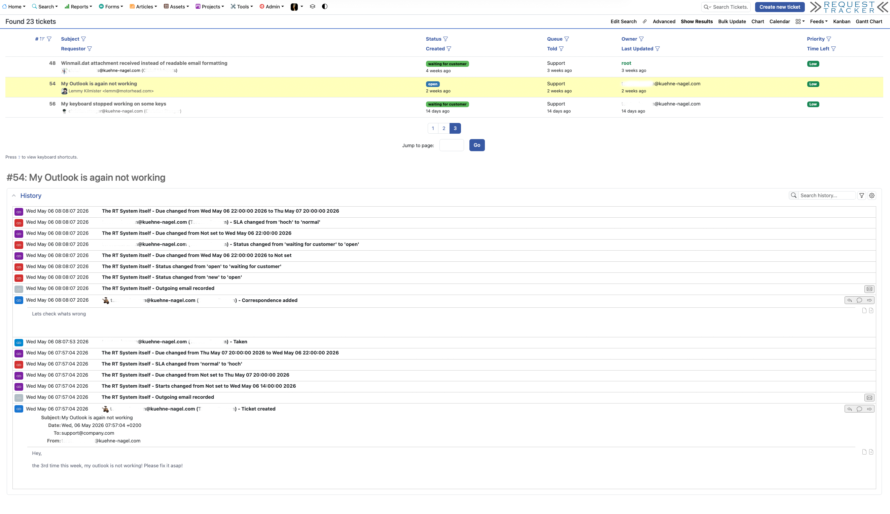
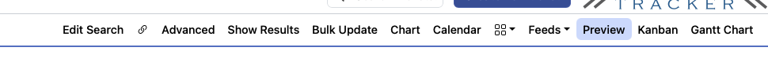

# RT::Extension::PreviewInSearch

Preview ticket history directly from the search results page in RT 6.

## Description

RT's query builder lets you customize all columns shown in search results, so
you can usually get all the ticket metadata you need on one page. But sometimes
you also need to see something from the ticket history without clicking over to
the full display page.

This extension shows the history of a ticket at the bottom of (or beside) the
search results page — just click anywhere in a ticket row.



## RT Versions

Works with RT 6.0. Install the latest 0.* version for older RTs.

## Installation

```
perl Makefile.PL
make
sudo make install
```

Edit `/opt/rt6/etc/RT_SiteConfig.pm` and add:

```perl
Plugin( "RT::Extension::PreviewInSearch" );
Set( $PreviewInSearch, 1 );
```

Clear the mason cache and restart your webserver:

```
rm -rf /opt/rt6/var/mason_data/obj
sudo systemctl restart apache2
```

## Configuration

### `$PreviewInSearch`

Enables or disables the ticket history preview. Can also be set per user in
their preferences under **Settings → General**.

```perl
Set($PreviewInSearch, 1);
```


### `$SideBySidePreview`

Divides the search results page in half and displays the selected ticket history
to the right of the results instead of below.

```perl
Set($SideBySidePreview, 1);
```

## Usage

1. Perform a search.
2. Click anywhere in a ticket row — the history for that ticket appears below
   (or to the right in side-by-side mode).
3. Use the **Preview** button in the search menu bar to toggle the preview
   panel on or off without changing your saved preferences. The state is
   remembered across page navigations via the browser's local storage.



4. If inline edit is enabled for some fields, click outside the edit area
   (a pencil icon appears when hovering over editable fields).

To reduce scrolling, set **Rows per page** to a smaller number in the search
settings.

The preview only shows ticket creation, internal comments and email replies
(Correspond). Status changes, owner assignments and other system transactions
are intentionally hidden to keep the list focused.

## Author

Best Practical Solutions, LLC

## License

Copyright (c) 2007-2023 Best Practical Solutions, LLC.
Licensed under the GNU General Public License, Version 2.
